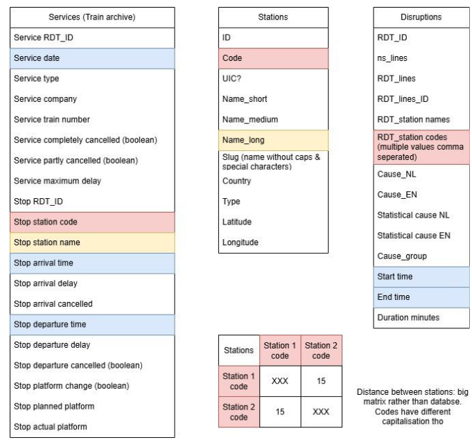

# MBD Train Disruptions

This is the final assignment for the UTwente cource Managing Big Data proposed by group 17.

## Research Questions

What factors drive delays in the Dutch railway system, and to what extent can these disruption causes be better understood by integrating external data (e.g., weather)?

- How strongly do weather conditions (rain, wind, temperature, etc.) correlate with delay frequency?

- How do delay patterns vary across train types, providers, or neighboring countries?

- How do delays differ across time (rush hours, seasons, years)?


## Datasets Used

- [Dutch railway network & disruptions dataset](https://www.rijdendetreinen.nl/en/open-data)

## Usage

1. Clone this repository:

```
git clone https://github.com NyistMilan/ipcv_final_assignment.git
    
cd ipcv_final_assignment
```

2. Create and activate an environment:

 ```
conda create -n mbd_train_disruptions -y

conda activate mbd_train_disruptions
```

3. Install dependencies:

```
pip install -e .
```

4. Running scripts:

scrape_train_data.py:

Note: If HDFS_DIR is present, it will move the files to HDFS.
```
python src/create_master_data.py
```

create_master_data.py:
```
spark-submit --deploy-mode cluster --driver-memory 6g --executor-memory 6g --conf spark.dynamicAllocation.maxExecutors=15 src/create_master_data.py
```

## ER Diagram

